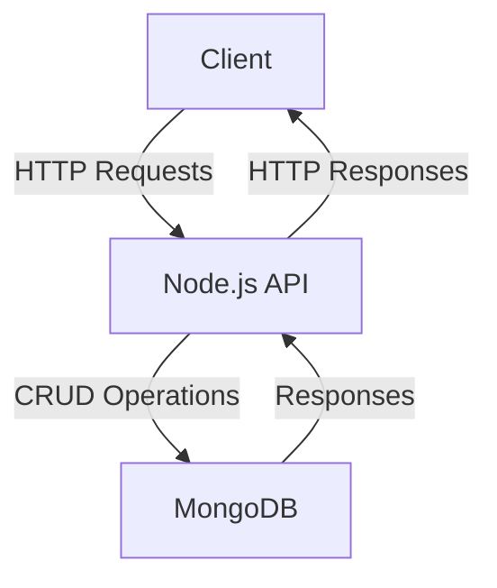
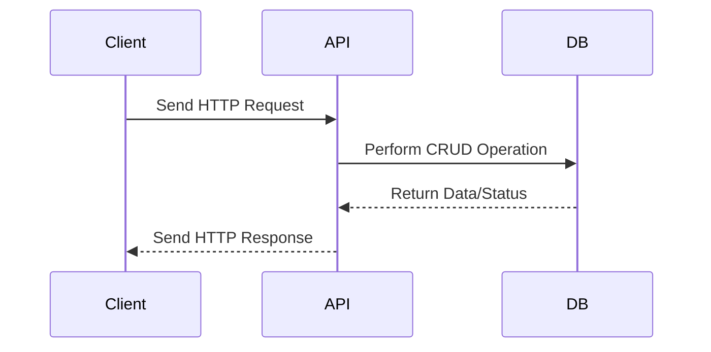

# Sample Node.js Application

This document provides an overview of a sample Node.js application, including its architecture and workflow.

## Application Overview

The sample Node.js application is a RESTful API that performs CRUD operations on a database. It uses the following technologies:
- **Node.js**: JavaScript runtime
- **Express.js**: Web framework
- **MongoDB**: NoSQL database
- **Mongoose**: ODM for MongoDB

## Architecture Diagram



## Workflow Diagram



## File Structure

```plaintext
project/
├── src/
│   ├── controllers/
│   ├── models/
│   ├── routes/
│   └── app.js
├── package.json
└── README.md
```

## Reference Links

- [Node.js Documentation](https://nodejs.org/en/docs/)
- [Express.js Guide](https://expressjs.com/)
- [MongoDB Documentation](https://www.mongodb.com/docs/)
- [Mongoose Documentation](https://mongoosejs.com/docs/)
- [Mermaid.js Documentation](https://mermaid.js.org/)
